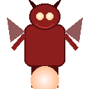

# 🌑 Dark Realm: Gothic ARPG Engine

A high-performance, browser-based Action RPG (ARPG) built with vanilla JavaScript and HTML5 Canvas. Inspired by classics like Diablo 2 and World of Warcraft, featuring a deep talent system, procedural dungeons, and premium modern VFX.

 

## 🌟 Key Features

- **9 Playable Classes**: Warrior, Sorceress, Rogue, Paladin, Druid, Necromancer, Shaman, Ranger, Warlock.
- **Deep Talent Trees**: 3 specialized endgame builds per class with unique active and passive skills.
- **HD Procedural Graphics**: Custom-generated high-definition sprites for enemies, items, and environments.
- **Advanced Combat Engine**:
  - Projectile & AoE systems with elemental types (Fire, Cold, Lightning, Poison, Shadow).
  - High-performance particle system for spell trails and hit impacts.
  - Screen shake and dynamic floating combat text.
- **Classic ARPG Systems**:
  - **Loot & Gear**: Rarity-based item generation (Normal, Magic, Rare, Unique).
  - **Gems & Sockets**: Socketable items with dynamic stat scaling and basic Runeword support.
  - **Crafting**: Item upgrading and gambling systems at the Merchant.
  - **Mercenaries**: Hire companions to fight by your side.
- **Endgame Content**: Infinite procedural rifts with difficulty scaling (Normal, Nightmare, Hell).

## 🚀 Getting Started

### Prerequisites
- Python 3.x (to run the local development server).

### Running the Game
1. Clone the repository:
   ```bash
   git clone https://github.com/YOUR_USERNAME/dark-realm.git
   cd dark-realm
   ```
2. Start the Python server:
   ```bash
   python -m http.server 8000
   ```
3. Open your browser and navigate to:
   `http://localhost:8000`

## 🛠️ Tech Stack
- **Engine**: Vanilla JavaScript (ES6 Modules).
- **Rendering**: HTML5 Canvas API with custom `Renderer.js` optimization.
- **Audio**: Web Audio API (Synthesized sounds, no external assets required).
- **Assets**: Procedural Pillow-based generation scripts (Python).

---
*Created with 🖤 for the ARPG community.*
